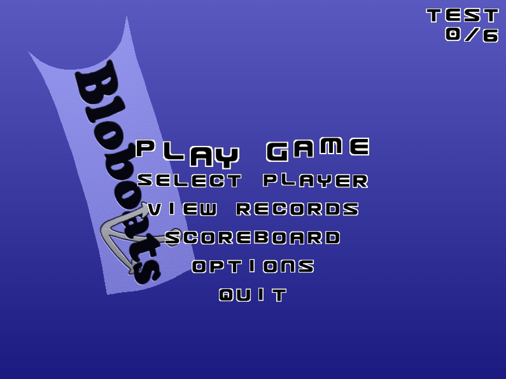
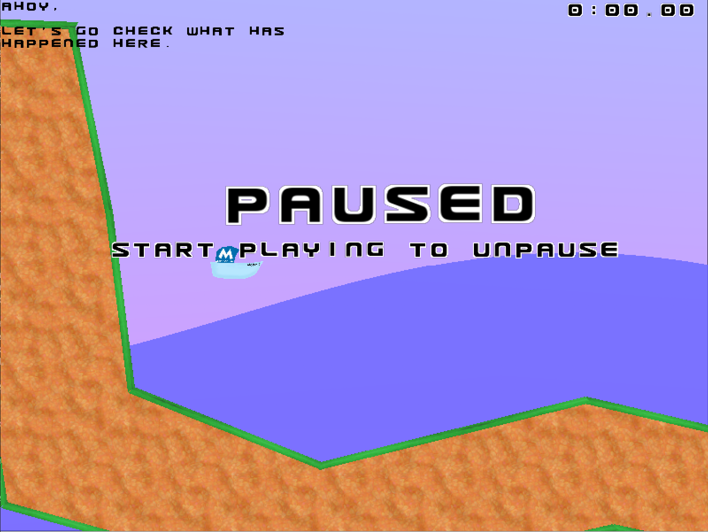

Bloboats
========

A Game created by Markus Kettunen and was forked from https://salsa.debian.org/games-team/bloboats.
A few line of codes was updated to be able to compile the game in Ubuntu & FreeBSD.

Building on FreeBSD 13.1
========================
::

    pkg install libvorbis sdl sdl_mixer sdl_image sdl_net
    make TARGET=FREEBSD
    make install

Building on Ubuntu 22.04 LTS
============================
::

    apt install libsdl1.2-dev libsdl-mixer1.2-dev libsdl-image1.2-dev libsdl-net1.2-dev libvorbis-dev
    make
    make install

Screenshot
==========

